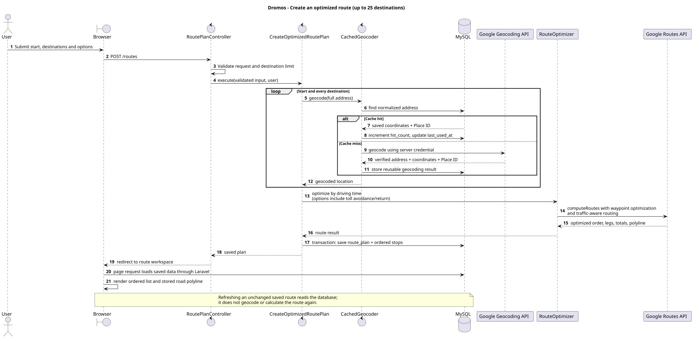
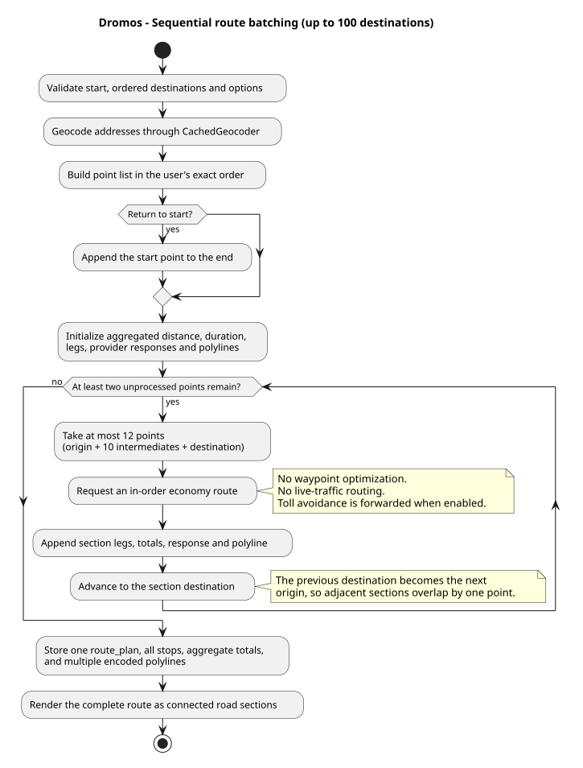
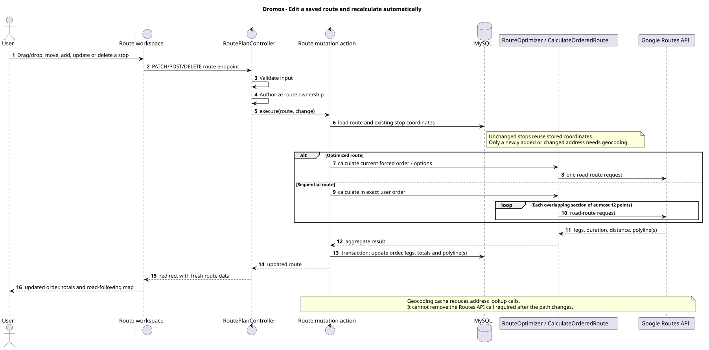
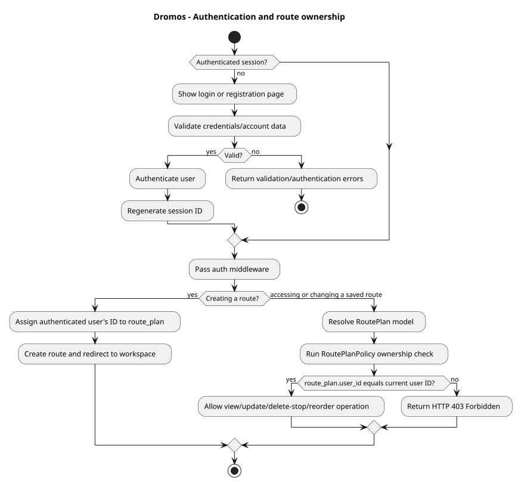

# Dromos architecture diagrams

These PlantUML diagrams document the paths a feature developer is most likely to change. They describe the intended architecture; keep them updated when a workflow, table, external integration, or authorization rule changes.

## Optimized route creation

The main route-creation workflow, including geocoding, optimization, and persistence.

[View PlantUML source](src/optimized-route-sequence.puml)

## Sequential route batching

Routes over 25 stops, ordered routing, batching limits, and polyline aggregation.

[View PlantUML source](src/sequential-route-batching.puml)

## Route editing and recalculation

Drag-and-drop, manual ordering, adding, editing, and deleting stops, and automatic recalculation.

[View PlantUML source](src/route-edit-recalculation.puml)

## Authentication and authorization

Login, registration, sessions, route ownership, middleware, and policies.

[View PlantUML source](src/authentication-authorization.puml)

## Rendering

SVG files in `rendered/` are generated and committed automatically when a PlantUML source file is added or changed.

With PlantUML installed, render every diagram locally from the project root:

    plantuml -tsvg -o ../rendered docs/diagrams/src/*.puml
